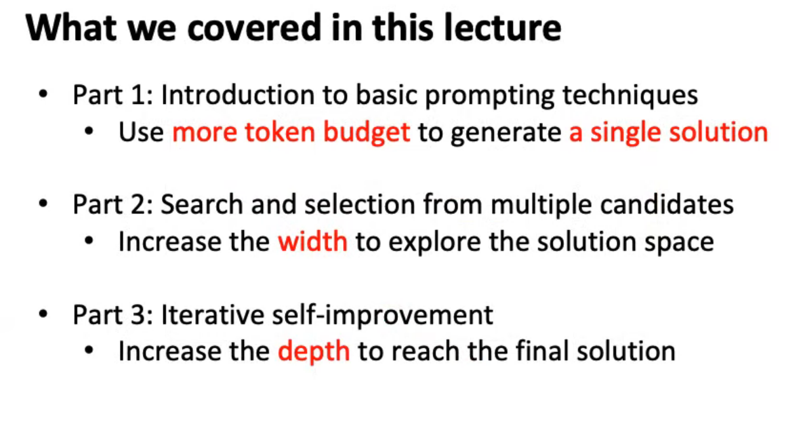
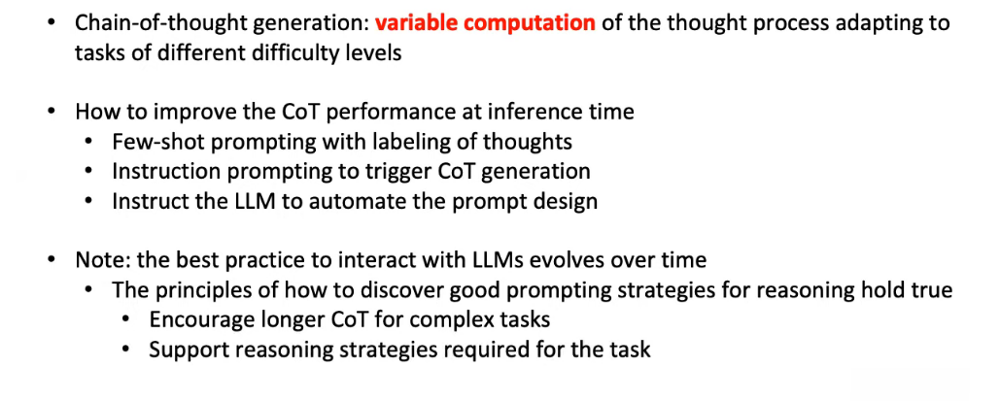
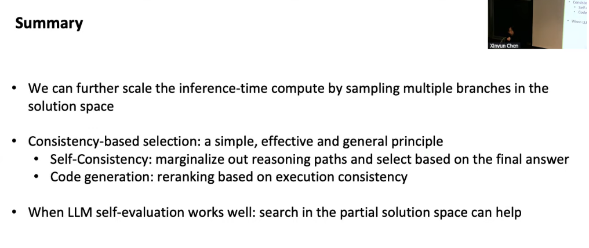
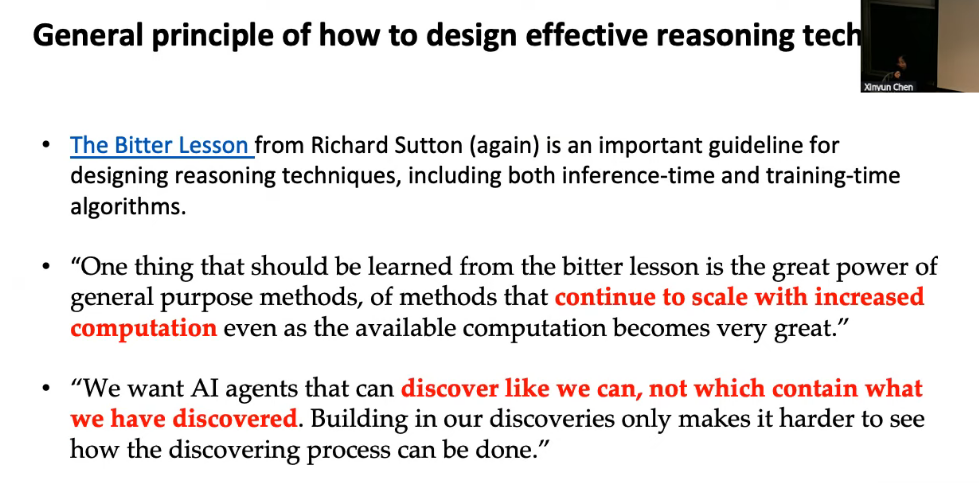

# Berkley Course On Advanced LLM Agents
## Table of Contents
1. [Week-18 : Inference-Time Techniques for LLM Reasoning](#week-18)
2. [Week-19]()

### Week-18

1. [ ] [Live-Stream 28 Jan 5:30 - 7: 30 after 30 min : Inference-Time Techniques for LLM Reasoning by Xinyun Chen, Google DeepMind](https://www.youtube.com/live/g0Dwtf3BH-0)

Lecture Summary

Weekly Reading and Writing Article and Publishing on Linkedin and Submitting
1. https://arxiv.org/abs/2309.03409
2. https://arxiv.org/abs/2310.01798
3. https://arxiv.org/abs/2304.05128
- Large Language Models as Optimizers
- Large Language Models Cannot Self-Correct Reasoning Yet
- Teaching Large Language Models to Self-Debug

Weekly Quizes : 
1. [ ]
2.  [ ]
3. [ ]
4. [ ] 
5. [ ]
6. [ ]

### Week-19
2. [ ] [Live-Lec  4rd Feb: Learning to reason with LLMs by Jason Weston, Meta]()

Weekly Reading and Writing Article and Publishing on Linkedin and Submitting

- Direct Preference Optimization: Your Language Model is Secretly a Reward Model
- Iterative Reasoning Preference Optimization
- Chain-of-Verification Reduces Hallucination in Large Language Models

3. [ ] [Live -Lec 24 Feb : Reasoning and Planning in LLMs by Hanna Hajishirzi, University of Washington]()
4. [ ] [Live -Lec 10th Mar : Coding agents/web agents Ruslan Salakhutdinov, CMU/Meta]()
5. [ ] [Live -Lec 27th Mar : Agents at Salesforce Caiming Xiong, Salesforce]()
6. [ ] [Live -Lec 7th April : Language models for autoformalization and theorem proving Kaiyu Yang, Meta FAIR]()
7. [ ] [Live -Lec 21st April : Program verification & generating verified code Swarat Chaudhuri, UT Austin ]()
8. [ ] [Live -Lec 28th April : Agent safety & security Dawn Song, UC Berkeley]()
9. [ ] [Live -Lec]()
10. [ ] [Live -Lec]()
## References
1. [UC Berkley Official Archive Site](https://classes.berkeley.edu/)